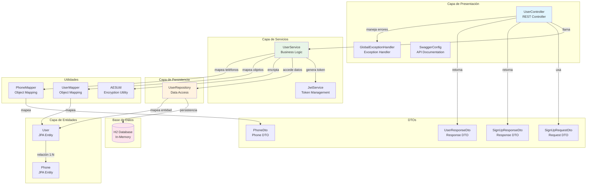

# Diagrama de Componentes - BCI Project API REST

Este diagrama muestra la arquitectura de componentes del sistema BCI Project API REST, incluyendo las diferentes capas y sus relaciones.

## Descripción de Componentes

### Capa de Presentación
- **UserController**: Controlador REST que maneja las peticiones HTTP
- **GlobalExceptionHandler**: Maneja las excepciones globalmente
- **SwaggerConfig**: Configuración para documentación de API

### Capa de Servicios
- **UserService**: Contiene la lógica de negocio para gestión de usuarios
- **JwtService**: Maneja la generación y validación de tokens JWT

### Capa de Persistencia
- **UserRepository**: Interfaz de acceso a datos usando Spring Data JPA

### Capa de Entidades
- **User**: Entidad JPA que representa un usuario
- **Phone**: Entidad JPA que representa un teléfono

### DTOs
- **SignUpRequestDto**: DTO para solicitud de registro
- **SignUpResponseDto**: DTO para respuesta de registro
- **UserResponseDto**: DTO para respuesta de usuario
- **PhoneDto**: DTO para teléfono

### Utilidades
- **AESUtil**: Utilidad para encriptación de contraseñas
- **UserMapper**: Mapeo entre entidades User y DTOs
- **PhoneMapper**: Mapeo entre entidades Phone y DTOs

## Patrones de Arquitectura

El sistema sigue una arquitectura en capas (Layered Architecture):

1. **Capa de Presentación**: Maneja la interfaz REST y documentación
2. **Capa de Servicios**: Contiene la lógica de negocio
3. **Capa de Persistencia**: Acceso a datos
4. **Capa de Entidades**: Modelo de dominio

## Tecnologías Utilizadas

- **Spring Boot 2.5.14**: Framework principal
- **Spring Data JPA**: Para persistencia
- **H2 Database**: Base de datos en memoria
- **JWT**: Para autenticación
- **Swagger/OpenAPI**: Para documentación
- **Lombok**: Para reducir código repetitivo 