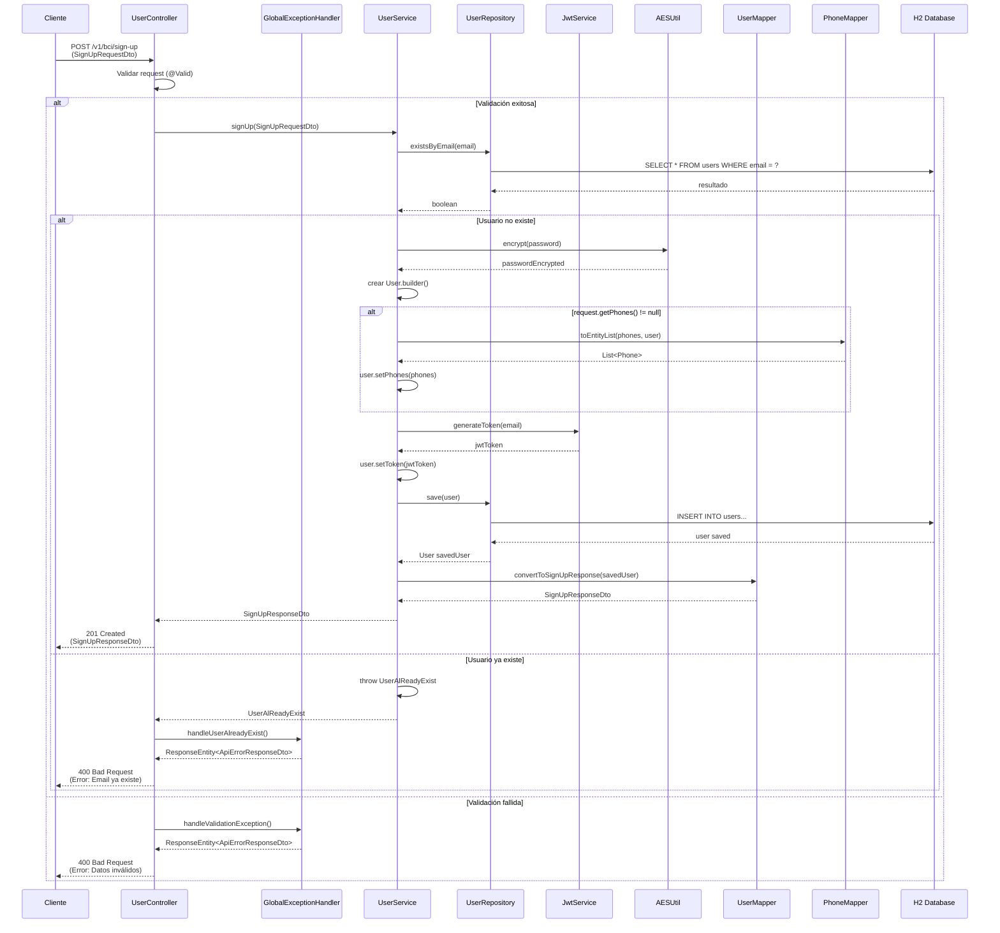

# Diagrama de Secuencia - Registro de Usuario

Este diagrama muestra el flujo de interacción entre componentes durante el proceso de registro de un nuevo usuario en el sistema BCI Project API REST.

## Descripción del Flujo

El diagrama ilustra el proceso completo de registro de usuario, desde la recepción de la petición HTTP hasta la persistencia en base de datos, incluyendo:

1. **Validación de entrada**: Validación de datos del request
2. **Verificación de unicidad**: Verificación de que el email no esté registrado
3. **Encriptación**: Encriptación de la contraseña del usuario
4. **Generación de token**: Creación de token JWT
5. **Persistencia**: Guardado en base de datos
6. **Mapeo de respuesta**: Conversión a DTO de respuesta

## Casos de Uso Cubiertos

- ✅ **Registro exitoso**: Usuario nuevo con datos válidos
- ❌ **Usuario ya existe**: Email ya registrado en el sistema
- ❌ **Datos inválidos**: Validación de entrada fallida

## Componentes Participantes

### Cliente
- Aplicación externa que consume la API REST
- Envía peticiones HTTP POST con datos de usuario

### UserController
- Punto de entrada REST para el endpoint `/v1/bci/sign-up`
- Valida el request usando anotaciones de validación
- Maneja respuestas HTTP y códigos de estado

### UserService
- Contiene la lógica de negocio del registro
- Coordina las operaciones entre diferentes componentes
- Maneja las reglas de negocio (unicidad de email, etc.)

### UserRepository
- Interfaz de acceso a datos usando Spring Data JPA
- Proporciona métodos para verificar existencia y guardar usuarios

### JwtService
- Genera tokens JWT para autenticación
- Configura expiración y algoritmo de firma

### AESUtil
- Utilitaria para encriptación de contraseñas
- Implementa algoritmo AES para seguridad

### UserMapper y PhoneMapper
- Convierten entre entidades JPA y DTOs
- Mantienen separación entre capas de datos y presentación

### GlobalExceptionHandler
- Maneja excepciones de forma centralizada
- Proporciona respuestas de error consistentes

### H2 Database
- Base de datos en memoria para persistencia
- Almacena usuarios y teléfonos con relaciones JPA

## Códigos de Respuesta

- **201 Created**: Registro exitoso
- **400 Bad Request**: Datos inválidos o email ya existe
- **500 Internal Server Error**: Error del servidor

## Validaciones Implementadas

1. **Email único**: Verificación en base de datos
2. **Formato de email**: Validación de sintaxis
3. **Contraseña segura**: Una mayúscula, dos números, 8-12 caracteres
4. **Nombre obligatorio**: Campo requerido
5. **Teléfonos opcionales**: Pueden ser nulos o vacíos 